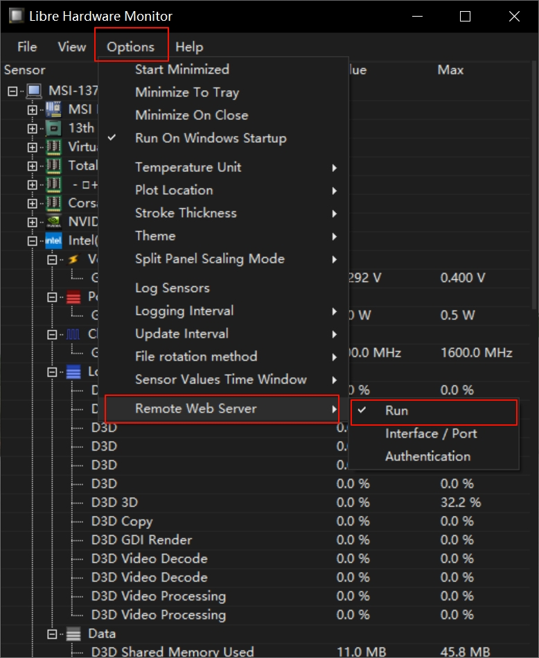

# LHM Exporter

A Prometheus exporter for [LibreHardwareMonitor](https://github.com/LibreHardwareMonitor/LibreHardwareMonitor), exposing Windows hardware metrics.

基于 LibreHardwareMonitor 的面向 Windows 的 Exporter，支持 Prometheus 指标采集与持久化。

## Prerequisites / 前置条件

[LibreHardwareMonitor](https://github.com/LibreHardwareMonitor/LibreHardwareMonitor) needs to be installed on the monitored machine, and its web interface must be enabled.

需要在被监控的机器上安装 LibreHardwareMonitor 并打开 Web 接口：

Option -> Remote Web Server -> Run



## Installation / 安装

Download the latest release the Releases page or build from source.

从仓库的Release中下载最新版即可。

## Usage / 使用方法

`lhm_exporter` does not need to be deployed on the same machine as LibreHardwareMonitor; it only needs to be able to access its interface over the network.

`lhm_exporter` 不是必须与 LibreHardwareMonitor 部署在同一台机器上，只需能访问其接口即可。

```bash
lhm_exporter [flags]
```

### Flags / 启动参数

| Flag                             | Default     | Description                                                     |
| -------------------------------- | ----------- | --------------------------------------------------------------- |
| `--web.listen-address`           | `0.0.0.0`   | IP address or host to listen on for web interface and telemetry |
| `--web.listen-port`              | `18085`     | Port to listen on for web interface and telemetry               |
| `--web.telemetry-path`           | `/metrics`  | Path under which to expose metrics                              |
| `--web.disable-exporter-metrics` | `false`     | Exclude metrics about the exporter itself                       |
| `--dest.address`                 | `127.0.0.1` | IP address of the monitored device                              |
| `--dest.port`                    | `8085`      | Port of the monitored device                                    |
| `--scrape.timeout`               | `10s`       | Timeout for scraping LHM data                                   |
| `-v`, `--version`                | <br />      | Show version information                                        |

### Examples / 常用用法

Local machine monitoring:

监控本地机器

```bash
lhm_exporter
```

Remote machine monitoring:

监控远程机器

```bash
lhm_exporter --dest.ip 192.168.1.100
```

LibreHardwareMonitor's built-in web interface is HTTP only, so `lhm_exporter` always connects to the upstream target over HTTP.

LibreHardwareMonitor 内置 Web 接口仅支持 HTTP，因此 `lhm_exporter` 始终通过 HTTP 连接上游目标。

The default port is 18085, and the metrics endpoint is: `http://<your-ip>:18085/metrics`.

默认端口为 18085，访问地址为：`http://<你的IP>:18085/metrics` 。

## Prometheus Configuration / Prometheus 配置示例

```yaml
scrape_configs:
  - job_name: 'lhm'
    static_configs:
      - targets: ['localhost:18085']
    metrics_path: /metrics
    scrape_interval: 15s
    scrape_timeout: 10s
```

## Metrics / 指标列表

### Exporter health / Exporter 自身指标

| Metric                        | Type    | Description                                            |
| ----------------------------- | ------- | ------------------------------------------------------ |
| `lhm_up`                      | Gauge   | Was the last scrape of LibreHardwareMonitor successful |
| `lhm_scrape_duration_seconds` | Gauge   | Duration of the last scrape in seconds                 |
| `lhm_scrape_errors_total`     | Counter | Total number of scrape errors                          |
| `lhm_scrape_samples_total`    | Gauge   | Total number of samples scraped                        |

### Hardware metrics / 硬件指标

| Metric                                   | Type  | Labels                        | Description                       |
| ---------------------------------------- | ----- | ----------------------------- | --------------------------------- |
| `lhm_cpu_temperature_celsius`            | Gauge | device, device\_model, sensor | CPU temperature                   |
| `lhm_cpu_voltage_volts`                  | Gauge | device, device\_model, sensor | CPU voltage                       |
| `lhm_cpu_power_watts`                    | Gauge | device, device\_model, sensor | CPU power consumption             |
| `lhm_cpu_clock_hertz`                    | Gauge | device, device\_model, sensor | CPU clock frequency               |
| `lhm_cpu_load_percent`                   | Gauge | device, device\_model, sensor | CPU load                          |
| `lhm_motherboard_temperature_celsius`    | Gauge | device, device\_model, sensor | Motherboard temperature           |
| `lhm_motherboard_voltage_volts`          | Gauge | device, device\_model, sensor | Motherboard voltage               |
| `lhm_motherboard_fan_speed_rpm`          | Gauge | device, device\_model, sensor | Motherboard fan speed             |
| `lhm_motherboard_control_percent`        | Gauge | device, device\_model, sensor | Motherboard control               |
| `lhm_ram_load_percent`                   | Gauge | device, device\_model, sensor | RAM load                          |
| `lhm_ram_data_bytes`                     | Gauge | device, device\_model, sensor | RAM data                          |
| `lhm_vram_load_percent`                  | Gauge | device, device\_model, sensor | VRAM load                         |
| `lhm_vram_data_bytes`                    | Gauge | device, device\_model, sensor | VRAM data                         |
| `lhm_physical_memory_data_bytes`         | Gauge | device, device\_model, sensor | Physical memory data              |
| `lhm_physical_memory_timing_nanoseconds` | Gauge | device, device\_model, sensor | Physical memory timing            |
| `lhm_gpu_temperature_celsius`            | Gauge | device, device\_model, sensor | GPU temperature                   |
| `lhm_gpu_voltage_volts`                  | Gauge | device, device\_model, sensor | GPU voltage                       |
| `lhm_gpu_power_watts`                    | Gauge | device, device\_model, sensor | GPU power                         |
| `lhm_gpu_clock_hertz`                    | Gauge | device, device\_model, sensor | GPU clock frequency               |
| `lhm_gpu_load_percent`                   | Gauge | device, device\_model, sensor | GPU load                          |
| `lhm_gpu_fan_speed_rpm`                  | Gauge | device, device\_model, sensor | GPU fan speed                     |
| `lhm_gpu_control_percent`                | Gauge | device, device\_model, sensor | GPU control                       |
| `lhm_gpu_data_bytes`                     | Gauge | device, device\_model, sensor | GPU data                          |
| `lhm_gpu_throughput_bytes_per_second`    | Gauge | device, device\_model, sensor | GPU throughput                    |
| `lhm_disk_temperature_celsius`           | Gauge | device, device\_model, sensor | Disk temperature                  |
| `lhm_disk_load_percent`                  | Gauge | device, device\_model, sensor | Disk load                         |
| `lhm_disk_level_percent`                 | Gauge | device, device\_model, sensor | Disk level                        |
| `lhm_disk_factor_ratio`                  | Gauge | device, device\_model, sensor | Disk factor ratio (dimensionless) |
| `lhm_disk_data_bytes`                    | Gauge | device, device\_model, sensor | Disk data                         |
| `lhm_disk_throughput_bytes_per_second`   | Gauge | device, device\_model, sensor | Disk throughput                   |
| `lhm_net_data_bytes`                     | Gauge | device, device\_model, sensor | Network data                      |
| `lhm_net_load_percent`                   | Gauge | device, device\_model, sensor | Network load                      |
| `lhm_net_throughput_bytes_per_second`    | Gauge | device, device\_model, sensor | Network throughput                |

## Notice / 注意事项

The `lhm_disk_data_bytes` metric may be inaccurate when the target device has encrypted drives.

`lhm_disk_data_bytes` 指标在遇到目标设备有驱动器处于加密状态时可能会读取不准确。

## Contributing

See [CONTRIBUTING.md](CONTRIBUTING.md).

## License

This project is licensed under the MIT License - see the [LICENSE](LICENSE) file for details.
